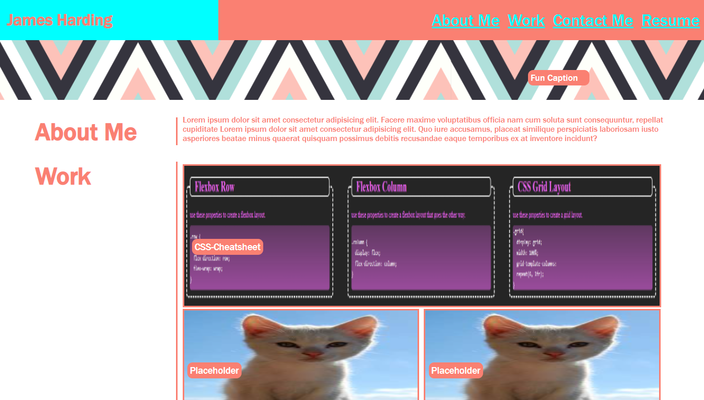
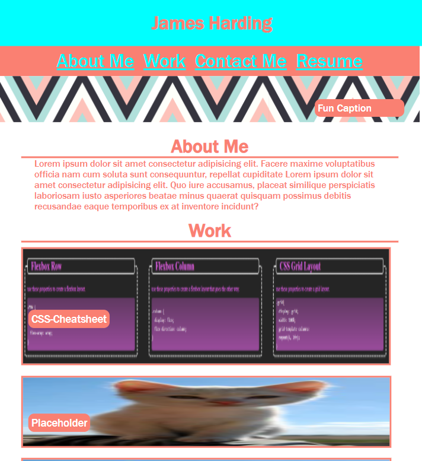

# Portfolio-adventure

This is an early draft of my personal portfolio.

-link to deployed website
https://jaha675.github.io/Portfolio-adventure/

-desktop display screenshot

-smaller res screenshot

This portfolio is still a little rough, given that there is no javascript involved and I have very few built projects so far. The main goal with this draft is to ensure that it works with different resolutions as well as displaying that I have at least basic competency with HTML and CSS.